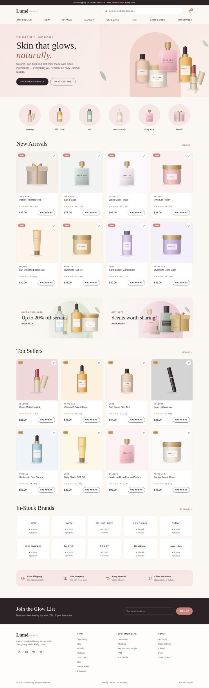
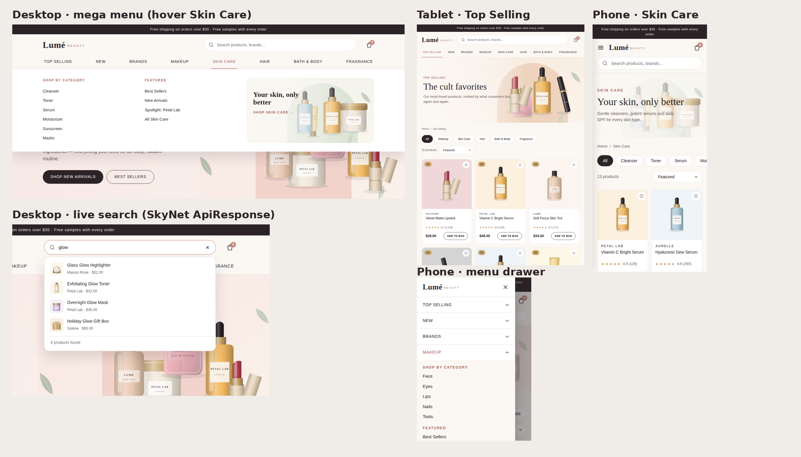

# Lumé Beauty — SkyNet Storefront Template

A responsive beauty-store website template for **ASP.NET Core (.NET 10)**, built on the **SkyNet Framework**.
Free and open source. **100% AI-driven coding.**

[](https://dotnet.microsoft.com/)
[](https://www.nuget.org/packages/TheSkyLite.SkyNet)
[](LICENSE)
[](#100-ai-driven-coding)



---

## Features

- **9 pages:** Home, Top Selling, New, Brands, Makeup, Skin Care, Hair, Bath & Body, Fragrance
- **Responsive:** desktop, tablet and phone layouts
  - Desktop: hover mega-menus with *Shop by Category*, *Featured* and a promo tile
  - Tablet: scrolling menu bar, 3-column product grid
  - Phone: slide-in menu with tap-to-expand sections, 2-column grid
- **Live search:** suggestions appear as you type, served by the page's C# method
- **Filters and sorting:** category chips and sort options update the grid in place, with no page reload
- **Deep links:** `Makeup?sub=lips`, `TopSelling?cat=skincare`, `Brands?brand=celeste`
- **Home page sections:** hero, category tiles, New Arrivals, promo banners, Top Sellers, In-Stock Brands, benefits strip, newsletter, footer
- **All artwork is SVG:** 54 product illustrations, hero, 8 banners, 10 brand logos — no external images
- **No front-end build:** plain HTML, CSS and vanilla JavaScript; no npm, no bundler, no SPA framework



---

## Getting started

**Requirements:** .NET 10 SDK and Visual Studio (or any editor with the `dotnet` CLI).

```bash
git clone <this-repository-url>
cd Beauty
dotnet run
```

Or open `Beauty.csproj` in Visual Studio and press **F5**.
The SkyNet package (`TheSkyLite.SkyNet`) restores automatically from NuGet.
The app opens on **Home** — the startup page set in `appConfig/application.cfg`.

---

## Project structure

```
Beauty/
├── appConfig/application.cfg     app settings and folder names (startup page = Home)
├── codes/                        page classes (C#)
│   ├── Models/BeautyModel.cs     catalog DTOs
│   ├── Home.cs  Makeup.cs  ...
├── htmls/                        page markup
├── scripts/                      page JavaScript
├── styles/                       page CSS
├── data/catalog.json             categories, brands and products
├── images/
│   ├── products/                 product illustrations (SVG)
│   ├── banners/                  page banners (SVG)
│   ├── brands/                   brand logos (SVG)
│   └── hero.svg
├── Properties/launchSettings.json   hot reload off
└── Program.cs
```

### One page = four files, one name

| File | Holds |
|---|---|
| `codes/Makeup.cs` | the page class (`: WebPage`) and its server methods |
| `htmls/Makeup.html` | markup with `{plhd_*}` placeholders |
| `scripts/Makeup.js` | one IIFE namespace, `MakeupJs` |
| `styles/Makeup.css` | styles, every class prefixed (`mk-`) |

Each page is self-contained: its own CSS prefix, its own script and its own C# methods.

---

## SkyNet in action

The browser calls a C# method; the method returns an `ApiResponse`; only that part of the page changes.

```js
// scripts/Makeup.js
$ApiRequest('Makeup/Filter', JSON.stringify([
    { key: 'key', vlu: 'lips' },
    { key: 'sort', vlu: 'low' }
]));
```

```csharp
// codes/Makeup.cs
public async Task<ApiResponse> Filter()
{
    ApiResponse response = new ApiResponse();
    ...
    response.SetElementContents("mk-grid", Grid(list, false));
    response.SetElementContents("mk-count", CountText(list.Count));
    return response;
}
```

Learn more: [SkyNet Developer Guide](https://www.theskylite.com/documents/SkyNet_Developer_Guide.html)

---

## Customize it

- **Products, prices, brands:** edit `data/catalog.json`
  - `isNew: true` → shows in *New* and the NEW badge
  - `topRank: 1..20` → shows in *Top Selling* in that order
- **Photos instead of SVG:** drop a file into `images/products/` and update its `image` path in the catalog
- **Colors and fonts:** change the CSS variables at the top of each page's stylesheet (`--mk-rose`, `--mk-serif`, …)
- **Company name:** search and replace `Lumé` in `htmls/` and the page titles in `codes/`

> Cart, *Add to bag*, wishlist and newsletter are visual only — wire them to your own backend.
> Brand names and products are fictional.

### Content items in the project file

The Web SDK already includes `*.json` files as content. If you add folder-wide `Content Include` rules,
exclude JSON from them to avoid **NETSDK1022 (duplicate Content items)**:

```xml
<Content Include="data\**" Exclude="data\**\*.json">
  <CopyToOutputDirectory>PreserveNewest</CopyToOutputDirectory>
  <CopyToPublishDirectory>Always</CopyToPublishDirectory>
</Content>
<Content Update="data\**\*.json">
  <CopyToOutputDirectory>PreserveNewest</CopyToOutputDirectory>
  <CopyToPublishDirectory>Always</CopyToPublishDirectory>
</Content>
```

---

## 100% AI-driven coding

Every file in this template — C#, HTML, CSS, JavaScript, the SVG artwork and the product catalog —
was generated by AI, directed and reviewed by the author.
No line was written by hand.

SkyNet's simple, predictable page model (one class, four files, `$ApiRequest` → `ApiResponse`)
is what makes this possible: the rules are few and consistent, so AI can generate complete,
working pages with very few errors.

---

## License

- **This template** (all source files, artwork and data in this repository): [MIT License](LICENSE) — free to use, modify and redistribute, including commercially.
- **SkyNet Framework** (`TheSkyLite.SkyNet` NuGet package): proprietary, free to use including commercial use; see the license included in the package.

---

## Links

- SkyNet Framework: https://www.theskylite.com
- NuGet package: https://www.nuget.org/packages/TheSkyLite.SkyNet
- SkyNet project template: https://github.com/hkim6000/ASPNETCoreEmpty.SkyNet

© 2026 HC Kim
